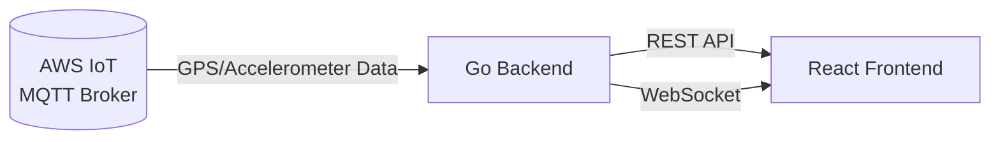

# B³ Ride Tracking

This project provides a real-time GPS ride tracking system, consisting of:

- **Backend**: A Go-based server that ingests MQTT GPS data, detects rides based on movement thresholds, persists ride data in SQLite, and exposes a RESTful API and WebSocket events for clients.
- **Frontend**: A React & TypeScript application (powered by Bun) that connects via WebSocket for live ride tracking, fetches historical rides via the API, and visualizes routes on Google Maps.

## Table of Contents

- [Architecture](#architecture)
- [Prerequisites](#prerequisites)
- [Installation](#installation)
- [Environment Configuration](#environment-configuration)
- [Running the Services](#running-the-services)
- [Directory Structure](#directory-structure)
- [Technology Stack](#technology-stack)

## Architecture



### Components

- **server/**: MQTT subscriber, ride manager, SQLite store, REST API (Gin), WebSocket hub, configuration.
- **frontend/**: React app with live tracking (`/rides/live`), historical rides overview (`/rides`), Google Maps integration, TypeScript types, and styling.

## Prerequisites

- **Go** 1.20+ (for backend)
- **Bun** (for frontend package management and scripts)
- **Google Maps API Key** (for map visualization)
- **MQTT Broker** (e.g., AWS IoT Core) publishing GPS data

## Installation

1. **Clone the repository**

    ```bash
    git clone <repository-url>
    cd <project-directory>
    ```

2. **Setup Backend**

    ```bash
    cd server
    go mod tidy
    go build -o server main.go
    ```

3. **Setup Frontend**

    ```bash
    cd ../frontend
    bun install
    ```

## Environment Configuration

### Backend (`server/config.json`)
Copy the provided `config.json` template and update the following fields:

```json
{
  "mqtt_broker_url": "tls://<broker-endpoint>:8883",
  "mqtt_client_id": "your-server-client-id",
  "mqtt_topic": "$aws/things/<thing-name>/shadow/update/accepted",
  "mqtt_cert_path": "certs/certificate.pem.crt",
  "mqtt_key_path": "certs/private.pem.key",
  "mqtt_root_ca_path": "certs/AmazonRootCA1.pem",
  "database_path": "data/rides.db",
  "server_address": ":8080",
  "ride_start_distance_meters": 50.0,
  "ride_end_inactivity_seconds": 300,
  "timezone_offset_seconds": -25200
}
```

### Frontend (`frontend/.env`)
Create a `.env` file in `frontend/` with the following:

```env
VITE_GOOGLE_MAPS_API_KEY=YOUR_GOOGLE_MAPS_API_KEY_HERE
VITE_API_BASE_URL=http://localhost:8080/api
```

## Running the Services

### Backend

```bash
cd server
# Run the built binary:
./server
# (or) Run directly:
go run main.go
```

### Frontend

```bash
cd frontend
bun dev
```
Open your browser at `http://localhost:5173` to view the application.

## Directory Structure

```
.
├── frontend/   # React & TypeScript application
└── server/     # Go backend service
```

## Technology Stack

- **Backend**: Go, Gin, Gorilla WebSocket, Eclipse Paho MQTT, SQLite
- **Frontend**: React, TypeScript, Vite, TanStack Router, CSS Modules